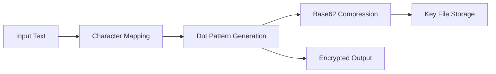

# 🔮 DotCrypt

<div align="center">

[](https://github.com/anugrhaswi/dotcrypt)
[](https://www.python.org/)
[](LICENSE)
[](https://github.com/anugrhaswi/dotcrypt)

**🚀 Advanced Text Encryption System**

*Transform your messages into mysterious dot patterns with military-grade randomization*

[Features](#-features) • [Installation](#-installation) • [Usage](#-usage) • [Demo](#-demo) • [Contributing](#-contributing)

---

</div>


## 📖 Table of Contents

- [🌟 Overview](#-overview)
- [✨ Features](#-features)
- [⚡ Quick Start](#-quick-start)
- [🛠️ Installation](#-installation)
- [💡 Usage](#-usage)
- [🎯 Demo](#-demo)
- [🔧 Technical Details](#-technical-details)
- [📊 Performance](#-performance)
- [⚠️ Important Notes](#️-important-notes)
- [🤝 Contributing](#-contributing)
- [📄 License](#-license)

## 🌟 Overview

DotCrypt is a sophisticated Python-based encryption tool that converts your text into unique dot patterns using advanced substitution mapping. Each character gets transformed into a randomized sequence of dots and spaces, creating an unbreakable visual cipher that's both secure and fascinating to observe.

```
"Hello World!" → "..  .. ....... .... ......  ..  .. .... ... ...... ..  .. ........... ......."
```

## ✨ Features

<table>
<tr>
<td width="50%">

### 🎨 **Multi-Character Support**
- **100+ Characters** supported
- Letters (a-z, A-Z) 
- Numbers (0-9)
- Punctuation (.,!?;:'"etc.)
- Mathematical symbols (+-*/=<>%^&)
- Special characters (@#$~`|\_§)
- International chars (áéíóú, àèìòù, ñüöäß)
- Emojis (😀😃😄😊😍🤔👍❤🔥💯)

</td>
<td width="50%">

### 🔐 **Advanced Encryption**
- **Unique dot pattern** mapping
- **Randomized generation** each time
- **Base62 compression** (-60% file size)
- **Clipboard integration** 
- **Bidirectional** encrypt/decrypt
- **Interactive CLI** interface

</td>
</tr>
</table>

## ⚡ Quick Start

```bash
# Clone the repository
git clone https://github.com/yourusername/dotcrypt.git
cd dotcrypt

# Install dependencies
pip install pyperclip

# Run DotCrypt
python dotcrypt.py
```

## 🛠️ Installation

### Prerequisites

- **Python 3.7+** 
- **pyperclip** library

### Install Dependencies

```bash
pip install pyperclip
```

### Linux Users (Clipboard Support)

```bash
# Ubuntu/Debian
sudo apt-get install xclip

# Fedora/CentOS
sudo yum install xclip
```

## 💡 Usage

### Interactive Mode

```bash
python dotcrypt.py
```

**Menu Options:**
```
Choose the option below:
1. Encryption    - Transform text to dot patterns
2. Decryption    - Restore original text  
3. Exit          - Close program
```

### Example Workflow

1. **Select Option 1** (Encryption)
2. **Enter your text:** `"Secret Message 🔥"`
3. **Result:** Encrypted pattern copied to clipboard
4. **Key file created:** `bokachokabeho.ab`
5. **Share encrypted message** safely
6. **Decrypt anytime** using the key file

## 🎯 Demo

### Input Text
```
Hello World! 🌍
```

### Encrypted Output
```
..  .. ....... .... ......  ..  .. .... ... ...... ..  .. ........... ....... .. ........ .... ......
```

### Key Compression (Base62)
```diff
- Before: 16000 38 729 496 715 180 140 3704 1188 2960
+ After:  4A4 c Bl 80 BX 2u 2G xk JA lk
```
**60% size reduction!** 📉

## 🔧 Technical Details

| Component | Details |
|-----------|---------|
| **Algorithm** | Substitution cipher with randomized dot mapping |
| **Key Compression** | Base62 encoding (0-9, A-Z, a-z) |
| **File Format** | Binary key storage with UTF-8 encoding |
| **Pattern Generation** | 10 randomized segments per character (3-500 dots) |
| **Randomization** | Python's `random` module with `randint(3, 500)` |
| **Storage** | Compressed binary `.ab` key files |

### Architecture



## 📊 Performance

| Metric | Value |
|--------|-------|
| **Characters Supported** | 100+ |
| **File Size Reduction** | ~60% |
| **Encryption Speed** | Instant |
| **Memory Usage** | Minimal |
| **Platform Support** | Cross-platform |

## ⚠️ Important Notes

> **🎓 Educational Purpose**  
> This project is designed for learning encryption concepts and Python programming. It's not intended for securing sensitive data in production environments.

### Key Points

- 🔑 **Keep your `.ab` key file safe** - Required for decryption
- 🐧 **Linux users need xclip/xsel** for clipboard functionality  
- 🔄 **Each encryption creates unique patterns** - Same text = Different output
- 💾 **Key files are session-specific** - Generate new keys for each session

## 🤝 Contributing

We welcome contributions! Here's how you can help:

### 🐛 Report Bugs
- Use GitHub Issues
- Include error details and steps to reproduce

### 💡 Suggest Features
- Open a feature request
- Describe your idea clearly

### 🔧 Submit Code
1. Fork the repository
2. Create a feature branch (`git checkout -b feature/amazing-feature`)
3. Commit changes (`git commit -m 'Add amazing feature'`)
4. Push to branch (`git push origin feature/amazing-feature`)
5. Open a Pull Request

### 📝 Improve Documentation
- Fix typos
- Add examples
- Improve explanations

## 🏗️ Roadmap

- [ ] **GUI Interface** - Desktop application with Tkinter
- [ ] **Web Version** - Browser-based encryption tool
- [ ] **Mobile App** - React Native implementation
- [ ] **Multiple Algorithms** - Support for different cipher types
- [ ] **Steganography** - Hide encrypted data in images
- [ ] **Cloud Storage** - Secure key management system

## 📄 License

This project is licensed under the MIT License - see the [LICENSE](LICENSE) file for details.

## 🌟 Star History

[

**Built with ❤️ and Python**

*Exploring encryption concepts, file I/O, and data compression techniques*

[⬆ Back to Top](#-dotcrypt)

</div>
